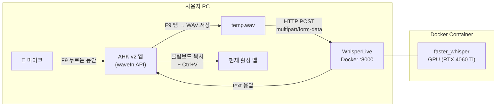
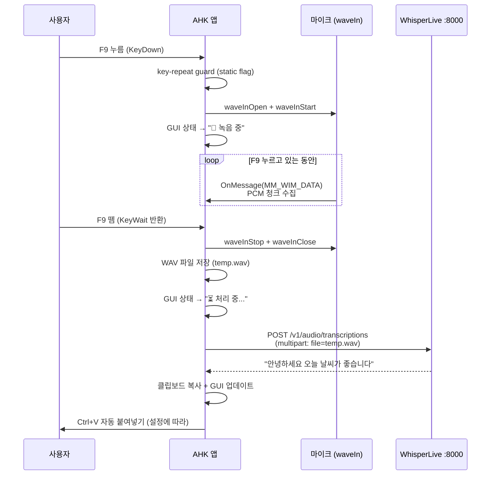

# WhisperLive Push-to-Talk STT — AutoHotkey v2 앱

로컬 WhisperLive Docker 서버(GPU)와 연동하여, **F9를 누르고 있는 동안 마이크 입력을 녹음**하고 **손을 떼면 STT 결과를 클립보드에 복사 + 자동 붙여넣기**하는 AutoHotkey v2 데스크톱 앱을 구현합니다.

## User Review Required

> [!IMPORTANT]
> **Docker 컨테이너 재시작 필요**: 현재 실행 중인 WhisperLive 컨테이너는 REST API가 비활성화 상태입니다. AHK에서 HTTP POST로 음성 파일을 전송하려면 `--enable_rest` 플래그와 포트 8000 노출이 필요합니다. 구현 시 컨테이너를 아래 명령으로 재시작합니다:
> ```bash
> docker rm -f whisperlive
> docker run -d --gpus all -p 9090:9090 -p 8000:8000 --name whisperlive \
>   ghcr.io/collabora/whisperlive-gpu:latest \
>   python run_server.py --port 9090 --backend faster_whisper --enable_rest
> ```

> [!IMPORTANT]
> **통신 방식 선택: REST API 사용**
> WhisperLive는 WebSocket(실시간 스트리밍)과 REST API(파일 전송) 두 가지를 지원합니다. AHK v2에는 네이티브 WebSocket 지원이 없으므로, **REST API(`/v1/audio/transcriptions`)** 방식을 채택합니다. F9를 누르는 동안 녹음 → WAV 파일 저장 → HTTP POST 전송 → 텍스트 수신 흐름입니다.

## Open Questions

> [!NOTE]
> 1. **자동 붙여넣기 동작**: F9를 떼면 결과를 (A) 클립보드에만 복사할지, (B) 클립보드 복사 + 현재 커서 위치에 자동 `Ctrl+V` 붙여넣기까지 할지? → 기본값은 **(B) 자동 붙여넣기**로 구현하되, 설정에서 끌 수 있도록 합니다.
> 2. **기본 언어**: `language` 필드를 `"ko"`(한국어 고정)로 할지, 비워서 자동 감지로 할지? → 기본값은 **자동 감지**로 하되, 설정에서 변경 가능하도록 합니다.
> 3. **단축키 변경**: F9 이외의 키로 변경할 수 있게 할지? → 1차 구현에서는 F9 고정, 추후 확장 가능하도록 구조만 잡아둡니다.

---

## 전체 아키텍처



---

## Proposed Changes

### 1. Docker 컨테이너 재구성

기존 컨테이너를 제거하고 REST API를 활성화한 새 컨테이너를 실행합니다.

- 포트 `9090` (WebSocket) + `8000` (REST API) 노출
- `--enable_rest` 플래그 추가
- `--backend faster_whisper` (GPU 가속)
- 컨테이너 이름: `whisperlive`

---

### 2. AutoHotkey v2 스크립트 — 파일 구조

설치 경로: `C:\Users\jb\.gemini\antigravity\scratch\WhisperSTT\`

#### [NEW] [WhisperSTT.ahk](file:///C:/Users/jb/.gemini/antigravity/scratch/WhisperSTT/WhisperSTT.ahk)
메인 스크립트. 아래 모든 모듈을 `#Include`로 결합합니다.

#### [NEW] [lib\AudioRecorder.ahk](file:///C:/Users/jb/.gemini/antigravity/scratch/WhisperSTT/lib/AudioRecorder.ahk)
`winmm.dll` waveIn* API를 사용한 마이크 녹음 클래스.

#### [NEW] [lib\WhisperAPI.ahk](file:///C:/Users/jb/.gemini/antigravity/scratch/WhisperSTT/lib/WhisperAPI.ahk)
REST API 통신 모듈 (HTTP POST multipart/form-data).

#### [NEW] [lib\AppGui.ahk](file:///C:/Users/jb/.gemini/antigravity/scratch/WhisperSTT/lib/AppGui.ahk)
메인 GUI + 설정 다이얼로그 + 트레이 메뉴.

---

### 3. 각 모듈 상세 설계

#### 3.1 AudioRecorder (`lib\AudioRecorder.ahk`)

| 항목 | 내용 |
|---|---|
| **API** | `winmm.dll` — `waveInOpen`, `waveInStart`, `waveInStop`, `waveInClose` 등 |
| **콜백 방식** | `CALLBACK_WINDOW` → AHK 메인 스레드의 `OnMessage(0x3C0)` 처리 |
| **녹음 포맷** | 16kHz, Mono, 16-bit PCM (WhisperLive 최적 포맷) |
| **버퍼** | 0.5초 × 3개 순환 버퍼 (16,000 bytes/버퍼) |
| **디바이스 열거** | `waveInGetNumDevs()` + `waveInGetDevCapsW()` → 드롭다운 목록 |
| **출력** | `Stop()` 호출 시 44바이트 RIFF/WAV 헤더 + PCM 데이터를 임시 파일로 저장 |

```
클래스 구조:
WaveAudioRecorder
  ├── GetDevices() → [{id, name}, ...]
  ├── Start(deviceId) → 녹음 시작
  ├── OnWaveData(msg) → PCM 청크 수집 (내부 콜백)
  ├── Stop(filePath) → 녹음 중지 + WAV 파일 저장
  └── SaveWavFile(path) → RIFF 헤더 작성 + PCM 데이터 쓰기
```

#### 3.2 WhisperAPI (`lib\WhisperAPI.ahk`)

| 항목 | 내용 |
|---|---|
| **엔드포인트** | `POST http://localhost:8000/v1/audio/transcriptions` |
| **통신** | `WinHttp.WinHttpRequest.5.1` COM 객체 |
| **요청 형식** | `multipart/form-data` — `file` (WAV 바이너리), `model`, `language`, `response_format` |
| **응답 형식** | `response_format=text` → 순수 텍스트 반환 (JSON 파싱 불필요) |
| **타임아웃** | 연결 5초, 응답 대기 30초 |
| **에러 처리** | HTTP 상태 코드 확인, 네트워크 오류 try/catch |

```
함수:
TranscribeAudio(endpoint, wavPath, model, language)
  → multipart body 구성 (SafeArray)
  → WinHttp POST 전송
  → 텍스트 결과 반환
```

#### 3.3 AppGui (`lib\AppGui.ahk`)

**메인 창 (약 330×190px, 항상 위)**

```
┌─────────────────────────────────────┐
│  🎙️ Voice Transcriber          [⚙] │  ← 다크 테마, 타이틀바
├─────────────────────────────────────┤
│  INPUT DEVICE:                      │
│  [▼ Microphone Array (Realtek)    ] │  ← 마이크 드롭다운
├─────────────────────────────────────┤
│  ┌─────────────────────────────────┐│
│  │  ● Hold F9 to Talk             ││  ← 상태 버튼 (색상 변경)
│  └─────────────────────────────────┘│
├─────────────────────────────────────┤
│  LAST TRANSCRIPTION:                │
│  안녕하세요 오늘 날씨가 좋습니다    │  ← 마지막 STT 결과
└─────────────────────────────────────┘
```

- **상태 표시**: 대기(회색) → 녹음 중(빨간색 깜빡) → 처리 중(노란색) → 완료(초록색, 2초 후 대기로)
- **다크 모드**: `DwmSetWindowAttribute` 로 Windows 11 다크 타이틀바 적용
- **위치 기억**: 창 닫기/종료 시 INI 파일에 X, Y 좌표 저장 → 다음 실행 시 복원
- **최소화 → 트레이**: 닫기 버튼 클릭 시 트레이로 최소화, 트레이 아이콘 클릭으로 복원

**설정 다이얼로그 (별도 창)**

```
┌──────────────────────────────────────┐
│  ⚙ Settings                         │
├──────────────────────────────────────┤
│  Whisper Server:                     │
│  [http://localhost:8000            ] │
│                                      │
│  Model:              Language:       │
│  [small           ]  [auto        ] │
│                                      │
│  ☐ Auto-paste after transcription    │
│  ☐ Auto-start on Windows login       │
│                                      │
│          [Save]    [Cancel]          │
└──────────────────────────────────────┘
```

- **서버 주소**: REST API 엔드포인트 (기본: `http://localhost:8000/v1/audio/transcriptions`)
- **모델**: Whisper 모델 선택 (tiny, base, small, medium, large-v3)
- **언어**: 자동 감지 / 한국어(ko) / 영어(en) / 일본어(ja) 등
- **자동 붙여넣기**: 체크 시 STT 완료 후 `Ctrl+V` 자동 입력
- **자동 시작**: 체크 시 레지스트리 `HKCU\...\Run`에 등록

#### 3.4 메인 스크립트 (`WhisperSTT.ahk`)

**F9 Push-to-Talk 흐름:**



**핵심 코드 패턴 (F9 핫키):**
- `*F9::` 핫키 + `static isKeyHeld` 플래그로 OS 키 리피트 방지
- `KeyWait("F9")` — AHK의 메시지 펌프는 계속 돌면서 오디오 콜백 수신
- `SetTimer(() => ProcessTranscription(), -1)` — API 호출을 별도 타이머 스레드에서 실행하여 GUI 블록 방지

---

### 4. 설정 파일 (INI)

#### [NEW] WhisperSTT.ini (자동 생성)
```ini
[Window]
X=100
Y=100

[Audio]
DeviceIndex=1

[API]
Endpoint=http://localhost:8000/v1/audio/transcriptions
Model=small
Language=
AutoPaste=1

[General]
AutoStart=0
```

---

### 5. 자동 시작 (Auto-Start)

- **방식**: `HKCU\Software\Microsoft\Windows\CurrentVersion\Run` 레지스트리 키
- **값**: `"C:\Program Files\AutoHotkey\v2\AutoHotkey64.exe" "C:\Users\jb\...\WhisperSTT.ahk"`
- **설정에서 체크/해제** 시 `RegWrite` / `RegDelete` 호출

---

### 6. 시스템 트레이

- 메인 창 닫기(×) → 트레이로 최소화 (앱 계속 실행, F9 핫키 유지)
- 트레이 아이콘 클릭 → 메인 창 복원
- 트레이 우클릭 메뉴: `Show` / `Settings` / `Exit`

---

## Verification Plan

### Automated Tests
1. Docker 컨테이너 실행 확인:
   ```bash
   curl -s -o NUL -w "%{http_code}" http://localhost:8000/v1/audio/transcriptions
   ```
   → 400 (파일 없음) 반환이면 REST API 정상 가동

2. WAV 파일 전송 테스트:
   ```bash
   curl -X POST http://localhost:8000/v1/audio/transcriptions -F "file=@test.wav" -F "response_format=text"
   ```

### Manual Verification
1. AHK 스크립트 실행 → 메인 GUI 표시 확인
2. 마이크 드롭다운에서 장치 선택 가능 확인
3. F9 누르고 있으면 "녹음 중" 상태 전환 확인
4. F9 떼면 STT 결과가 GUI에 표시되고 클립보드에 복사되는지 확인
5. 메모장 등에서 F9 → 말하기 → F9 뗌 → 텍스트 자동 붙여넣기 확인
6. 설정 다이얼로그 열기/저장 확인
7. 창 위치 기억 확인 (이동 후 종료 → 재실행)
8. 트레이 최소화/복원 확인
9. 자동 시작 설정 ON → 로그아웃/로그인 후 트레이에 앱 표시 확인
